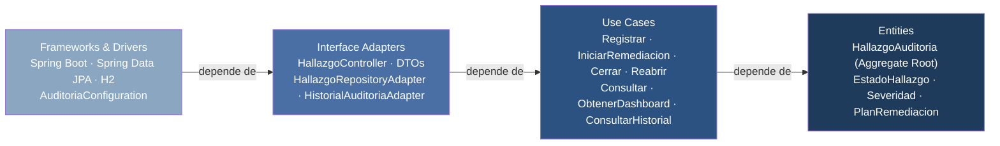
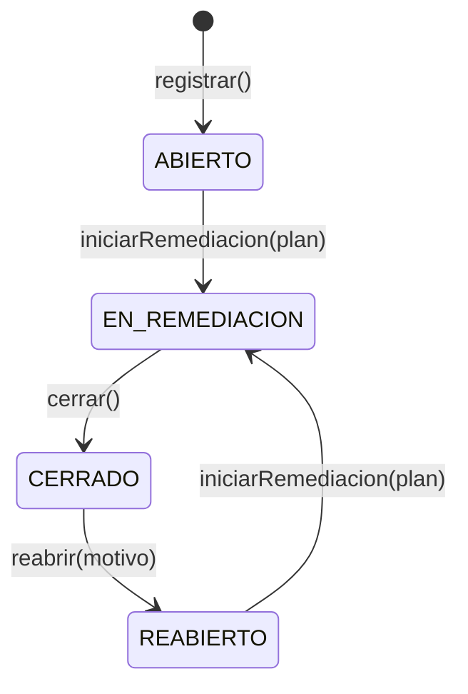
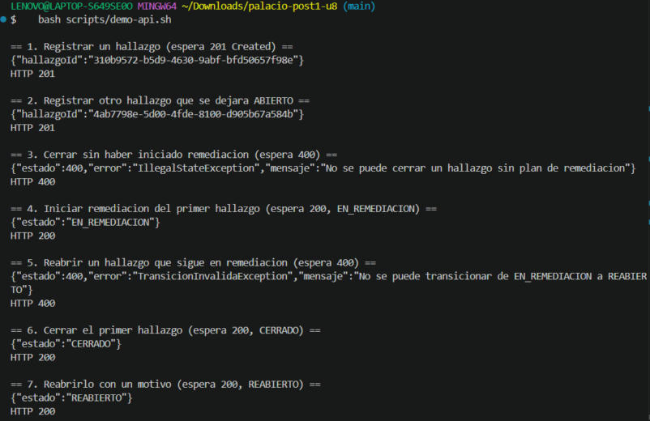
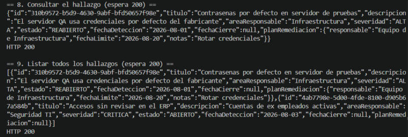
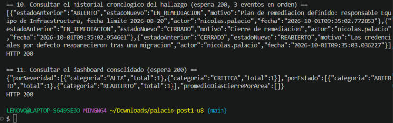

# Auditoría de Hallazgos — Clean Architecture y el costo real de CQRS/Event Sourcing

Post-contenido · Unidad 8 · Patrones de Diseño de Software · Sexto semestre
Ingeniería de Sistemas — Universidad de Santander (UDES), sede Cúcuta
Autor: Nicolás Andrés Palacio Boada · Docente: Jonathan Rolando Rey Castillo

Sistema de seguimiento de hallazgos de auditoría interna construido en dos etapas sobre
el mismo proyecto Spring Boot: primero su núcleo con Clean Architecture (cuatro círculos
concéntricos), y después una extensión real — dashboard consolidado y trazabilidad legal —
resuelta a partir de un análisis costo-beneficio explícito en lugar de adoptar CQRS o
Event Sourcing por reflejo.

## Tabla de contenido

1. [Resumen del sistema](#resumen-del-sistema)
2. [Parte 1 — Clean Architecture](#parte-1--clean-architecture)
3. [La máquina de estados del hallazgo](#la-máquina-de-estados-del-hallazgo)
4. [Parte 2 — Análisis costo-beneficio de CQRS y Event Sourcing](#parte-2--análisis-costo-beneficio-de-cqrs-y-event-sourcing)
5. [Extensión implementada](#extensión-implementada)
6. [Registro de decisiones de diseño](#registro-de-decisiones-de-diseño)
7. [Referencia de la API](#referencia-de-la-api)
8. [Cómo ejecutar](#cómo-ejecutar)
9. [Pruebas](#pruebas)
10. [Evidencia de ejecución](#evidencia-de-ejecución)
11. [Estructura del repositorio](#estructura-del-repositorio)
12. [Herramientas utilizadas](#herramientas-utilizadas)
13. [Conclusiones](#conclusiones)

## Resumen del sistema

Un hallazgo de auditoría interna se detecta, se remedia, se cierra y —si reaparece— se
reabre. Ese ciclo de vida es el núcleo del dominio y, deliberadamente, es lo único que la
Parte 1 modela con profundidad: una máquina de estados que rechaza por sí misma cualquier
transición que no tenga sentido de negocio. La Parte 2 no es un laboratorio distinto: es el
mismo sistema, un mes después, enfrentando dos peticiones reales del comité de auditoría y
de Cumplimiento. El repositorio documenta, en cada decisión, por qué se resolvió de una
forma y no de otra — incluida la decisión de *no* construir la solución más sofisticada
disponible.

## Parte 1 — Clean Architecture

El proyecto organiza el código en los cuatro círculos concéntricos de Clean Architecture.
La dependencia del código fuente solo puede apuntar hacia adentro; nunca hacia afuera.



El flujo de control entra por HTTP en `Frameworks & Drivers` y atraviesa los círculos de
afuera hacia adentro; la flecha del diagrama muestra la *dependencia de código*, que va en
esa misma dirección — hacia adentro — y nunca al revés: `Entities` no sabe que `Use Cases`
existe, y `Use Cases` no sabe que Spring existe.

| Círculo | Paquete | Contenido | Qué NO contiene |
|---|---|---|---|
| Entities | `domain/entity`, `domain/valueobject` | `HallazgoAuditoria` (Aggregate Root), `EstadoHallazgo`, `Severidad`, `PlanRemediacion` | Ningún import de `org.springframework` ni `jakarta.persistence` |
| Use Cases | `usecase`, `usecase/port`, `usecase/impl` | Interfaces de caso de uso, puertos de salida, implementaciones | Ningún import de Spring; no conoce JPA ni HTTP |
| Interface Adapters | `adapter/in/web`, `adapter/out/persistence` | `HallazgoController`, DTOs, `HallazgoJpaEntity`, adaptadores del repositorio | Reglas de negocio (viven en `domain`) |
| Frameworks & Drivers | `config`, `AuditoriaHallazgosApplication`, `application.properties` | Spring Boot, wiring explícito, H2 | — |

La regla de dependencia no es una promesa: es verificable. El script
[`scripts/verificar-regla-de-dependencia.sh`](scripts/verificar-regla-de-dependencia.sh)
inspecciona el código fuente y falla si `domain/` o `usecase/` importan algo de un círculo
más externo o de un framework.

```
$ ./scripts/verificar-regla-de-dependencia.sh
Regla de dependencia: el codigo solo apunta hacia adentro

  OK     domain/   no importa circulos externos (usecase, adapter, config)
  OK     domain/   no importa frameworks (Spring, JPA, Validation, Hibernate, Jackson)
  OK     usecase/  no importa circulos externos (adapter, config)
  OK     usecase/  no importa frameworks (Spring, JPA, Validation, Hibernate, Jackson)

Resultado: la regla de dependencia se cumple.
```

## La máquina de estados del hallazgo

`EstadoHallazgo` conoce sus propias transiciones válidas a través de
`puedeTransicionarA(...)`. De las dieciséis combinaciones origen-destino posibles entre
cuatro estados, solo cuatro están permitidas — y una prueba unitaria
(`EstadoHallazgoTest.soloCuatroDeDieciseis`) lo verifica de forma exhaustiva, no solo caso
por caso.



No se puede cerrar un hallazgo que nunca estuvo en remediación (`cerrar()` exige un plan ya
definido) ni reabrir uno que sigue abierto (`ABIERTO.puedeTransicionarA(REABIERTO)` es
`false`). Ambas reglas están en el dominio, no en el controlador: cualquier consumidor
futuro del agregado —otro endpoint, un job asíncrono, una prueba— hereda la misma
protección sin repetir el condicional.

## Parte 2 — Análisis costo-beneficio de CQRS y Event Sourcing

Antes de escribir código, el laboratorio exige responder las cinco preguntas de la guía de
la unidad aplicadas a la escala real de este proyecto — no a la escala de un sistema
bancario hipotético.

| Criterio (guía, secciones 4.4 y 7) | Respuesta para este proyecto |
|---|---|
| Escala y carga | Un único desarrollador ejecutando el proyecto localmente para fines académicos: cero usuarios concurrentes reales. No existe ninguna diferencia de escala entre lecturas y escrituras que justifique infraestructura separada, porque ambas ocurren contra la misma instancia H2 bajo la misma carga mínima. |
| Complejidad de las consultas | Los tres indicadores del dashboard —conteo por severidad, conteo por estado y promedio de días de cierre por área— se resuelven con dos consultas JPQL de agregación (`GROUP BY`, `COUNT`) y una consulta derivada sobre los hallazgos cerrados cuyo promedio se calcula en el adaptador, todo sobre el mismo esquema `hallazgos`. No requieren otra tecnología de base de datos ni un modelo desnormalizado aparte; una *interface projection* de Spring Data JPA es suficiente. |
| Consistencia | El comité revisa el dashboard antes de una reunión mensual: es, por definición, un reporte generado bajo demanda, igual que cualquier consulta agregada. No hay ninguna expectativa de tiempo real ni de actualización en milisegundos que justifique tolerar consistencia eventual a cambio de escalar el lado de lectura. |
| Naturaleza de la trazabilidad exigida | Cumplimiento necesita reconstruir *la secuencia* de cambios —quién, cuándo, de qué estado a qué estado—, no reconstruir el estado actual del hallazgo reproduciendo eventos uno por uno. Una bitácora cronológica adicional, que coexiste con el estado ya persistido, satisface literalmente el requisito sin convertir el historial en la fuente de verdad del agregado. |
| Señales de sobre-ingeniería | No hay ningún experto de negocio disponible para modelar un catálogo de eventos de dominio (el equipo es una sola persona). El desarrollador no tiene experiencia previa con Event Sourcing, y la guía documenta su curva de aprendizaje como alta incluso para equipos experimentados. Construir dos modelos sincronizados y un Event Store para un sistema con datos de prueba manuales sería exactamente la desproporción entre infraestructura y lógica de negocio real que la guía señala como alerta de sobre-ingeniería. |

**Conclusión razonada.** Los cinco criterios apuntan en la misma dirección: CQRS completo
y Event Sourcing completo no se justifican en este laboratorio. La escala es mínima, las
consultas del dashboard son alcanzables con SQL agregado convencional, la consistencia
eventual no resuelve ningún problema que este sistema tenga, la trazabilidad exigida es
más barata como bitácora que como fuente de verdad reconstruible, y el equipo carece de la
experiencia y del volumen que harían rentable la curva de aprendizaje. Por eso la extensión
implementada es deliberadamente liviana: el mismo `HallazgoRepositoryPort` se extiende con
tres métodos de consulta agregada —sin stack de lectura separado, sin otra base de datos—,
y la exigencia de Cumplimiento se resuelve con una tabla de auditoría adicional,
append-only, escrita en la misma transacción que cada transición de estado. Esta
conclusión se revisaría si apareciera un requisito concreto y verificable ausente hoy: por
ejemplo, que Cumplimiento exigiera reconstruir el estado exacto del hallazgo *en cualquier
instante pasado* (no solo la secuencia de cambios), o que el sistema pasara de un
prototipo académico a producción con miles de hallazgos concurrentes.

## Extensión implementada

En lugar de un stack de lectura separado, `HallazgoRepositoryPort` —el mismo puerto de la
Parte 1— gana tres métodos de consulta agregada sobre el mismo `HallazgoJpaRepository`: los dos
conteos usan *interface projections* de Spring Data JPA y el promedio de días de cierre se
calcula en el adaptador a partir de los hallazgos cerrados (así no depende de funciones de
fecha propias de H2):

```java
List<ConteoCategoria> contarPorSeveridad();
List<ConteoCategoria> contarPorEstado();
List<PromedioCategoria> promedioDiasCierrePorArea();
```

Para la trazabilidad, `HistorialAuditoriaPort` persiste cada transición en
`historial_cambios_estado` inmediatamente después de guardar el hallazgo, dentro del mismo
caso de uso —no en un evento asíncrono ni en un proceso separado—. La entidad JPA
correspondiente no expone ningún método para actualizar o borrar un registro ya insertado:
el único verbo posible sobre esa tabla es `save()` de una fila nueva.

## Registro de decisiones de diseño

Cada decisión sigue el mismo formato: el problema concreto, la decisión tomada, y por qué
la alternativa descartada no se prefirió.

**Decisión 1 — `Severidad` como enum simple frente a `EstadoHallazgo` como enum con
comportamiento.**
`EstadoHallazgo` encapsula una regla de negocio real y verificable: qué transiciones son
válidas. `Severidad`, en cambio, es una clasificación sin reglas propias — ninguna
severidad es "más válida" que otra en ningún momento del ciclo de vida, y ninguna
severidad restringe qué otra severidad puede seguirle. Dar a `Severidad` el mismo nivel de
comportamiento que a `EstadoHallazgo` —por ejemplo, un método `puedeEscalarA(...)` sin
ninguna regla real detrás— habría sido complejidad estructural sin contrapartida: una
interfaz y cuatro clases concretas para representar lo que un enum de cuatro valores ya
resuelve. El criterio no es "cuántos valores tiene", sino si existe una regla de negocio
que ese comportamiento deba encapsular.

**Decisión 2 — `PlanRemediacion` como Value Object embebido frente a agregado
independiente.**
Un hallazgo nunca puede pasar a `EN_REMEDIACION` sin un plan válido, ni cerrarse sin uno ya
definido (`HallazgoAuditoria.cerrar()` lanza `IllegalStateException` si `planRemediacion`
es nulo). Esa invariante debe cumplirse siempre dentro de la misma operación, sin ventana
de inconsistencia entre guardar el hallazgo y guardar su plan. Si `PlanRemediacion` fuera
un agregado independiente con su propio repositorio, referenciado por `HallazgoId`,
existiría un instante —entre ambas escrituras— en el que un hallazgo podría leerse en
`EN_REMEDIACION` sin que su plan estuviera realmente persistido. Modelarlo como Value
Object embebido garantiza que la invariante se cumple en la misma transacción, exactamente
el límite de consistencia transaccional que la guía de la unidad (sección 3.3) atribuye a
los Agregados: un Agregado no es un grupo de clases relacionadas, es una unidad atómica de
consistencia.

**Decisión 3 — CQRS y Event Sourcing completos frente a extensión liviana del repositorio
existente.**
Justificada en detalle en la sección [Análisis costo-beneficio](#parte-2--análisis-costo-beneficio-de-cqrs-y-event-sourcing)
anterior, aplicando los cinco criterios de la guía de la unidad (secciones 4.4 y 7) a la
escala real de este laboratorio. La alternativa descartada —CQRS y Event Sourcing
completos— habría significado dos modelos de escritura y lectura sincronizados
manualmente, un Event Store, versionado de eventos y una curva de aprendizaje que ningún
requisito real de este proyecto compensa hoy.

**Decisión 4 — Bitácora de auditoría simple frente a Event Store completo.**
Cumplimiento necesita mostrar la *secuencia* de cambios de un hallazgo, no reconstruir su
estado reproduciendo eventos. Migrar a un Event Store real exigiría que
`HallazgoJpaEntity` dejara de persistir el estado actual y que este se reconstruyera por
*replay* en cada lectura — un cambio de fondo sobre un agregado que ya funciona
correctamente, sin que exista hoy una necesidad de reproducir estados intermedios ni de
alimentar proyecciones adicionales todavía desconocidas. `HistorialCambioEstadoJpaEntity`
resuelve el requisito real con una tabla adicional, escrita en la misma transacción que
cada transición y sin ningún método de actualización o borrado, es decir, exactamente la
propiedad append-only que Cumplimiento pidió, sin pagar el costo de una fuente de verdad
reconstruible que nadie solicitó. Esta es, en los términos de la sección 7.2 de la guía de
la unidad, la señal de sobre-ingeniería que se decidió no ignorar: construir el Event
Store habría sido resolver un problema distinto —y más caro— del que realmente se planteó.

## Referencia de la API

Todos los endpoints viven bajo `/api/hallazgos`. Las escrituras aceptan una cabecera
opcional `X-Actor` (en un sistema real vendría del token de autenticación) que queda
registrada en la bitácora de cada transición.

| Método y ruta | Descripción | Código esperado |
|---|---|---|
| `POST /api/hallazgos` | Registra un hallazgo nuevo (nace `ABIERTO`) | `201 Created` |
| `GET /api/hallazgos` | Lista todos los hallazgos | `200 OK` |
| `GET /api/hallazgos/{id}` | Consulta un hallazgo puntual | `200 OK` / `404` |
| `PATCH /api/hallazgos/{id}/iniciar-remediacion` | `ABIERTO` → `EN_REMEDIACION` con plan | `200 OK` / `400` |
| `PATCH /api/hallazgos/{id}/cerrar` | `EN_REMEDIACION` → `CERRADO` | `200 OK` / `400` |
| `PATCH /api/hallazgos/{id}/reabrir` | `CERRADO` → `REABIERTO` con motivo | `200 OK` / `400` |
| `GET /api/hallazgos/{id}/historial` | Bitácora cronológica del hallazgo (Parte 2) | `200 OK` / `404` |
| `GET /api/hallazgos/dashboard` | Conteos y promedios consolidados (Parte 2) | `200 OK` |

## Cómo ejecutar

Requiere JDK 17 o superior y Maven 3.8+.

```bash
mvn clean package
mvn spring-boot:run
```

La aplicación queda disponible en `http://localhost:8080`. La consola de H2
(`http://localhost:8080/h2-console`, JDBC URL `jdbc:h2:mem:auditoria`, usuario `sa`, sin
contraseña) permite inspeccionar `hallazgos` y `historial_cambios_estado` mientras el
sistema está en ejecución.

Con la aplicación levantada, el script
[`scripts/demo-api.sh`](scripts/demo-api.sh) recorre el ciclo de vida completo de dos
hallazgos —incluyendo un intento de cierre inválido y una consulta del historial y del
dashboard— e imprime el código HTTP de cada llamada:

```bash
./scripts/demo-api.sh
```

## Pruebas

```bash
mvn test
```

El dominio y los casos de uso se prueban con JUnit 5 puro, sin `@SpringBootTest`: el
Aggregate Root se instancia con `new` y los casos de uso reciben un doble de prueba en
memoria (`RepositorioEnMemoria`, `HistorialEnMemoria`) en lugar de Spring o JPA reales,
tal como exige el checkpoint del Paso 6.

| Clase de prueba | Qué verifica |
|---|---|
| `EstadoHallazgoTest` | Las cuatro transiciones válidas, y que las 12 combinaciones restantes de las 16 posibles se rechazan |
| `HallazgoAuditoriaTest` | Invariantes del Aggregate Root: no hay cierre sin plan, no hay reapertura sin haber cerrado, `reconstituir(...)` preserva datos históricos |
| `CicloDeVidaHallazgoTest` | Los casos de uso de la Parte 1 orquestados de punta a punta contra un repositorio en memoria |
| `HistorialYDashboardTest` | Cada transición exitosa agrega exactamente un registro a la bitácora, en orden; una transición rechazada no deja rastro |

## Evidencia de ejecución

Salida de [`scripts/demo-api.sh`](scripts/demo-api.sh) contra la aplicación levantada
localmente con `mvn spring-boot:run`. Cada bloque muestra el paso numerado del script, el
código HTTP esperado y el obtenido, de modo que puede contrastarse con los checkpoints de
los Pasos 6 y 11. Las imágenes están en [`docs/capturas/`](docs/capturas).

**Pasos 1 a 7 — registro, transiciones inválidas (400) y ciclo de vida completo (Parte 1).**
`POST` devuelve `201` con el `hallazgoId`; cerrar un hallazgo `ABIERTO` y reabrir uno
`EN_REMEDIACION` devuelven `400`; iniciar remediación, cerrar y reabrir devuelven `200`.



**Pasos 8 y 9 — consulta puntual y listado.** El hallazgo queda en `REABIERTO` con su plan
de remediación embebido y la fecha de cierre limpiada por `reabrir()`.



**Pasos 10 y 11 — historial cronológico y dashboard (Parte 2).** El historial contiene
exactamente las tres transiciones, en orden y con su actor. El dashboard agrupa por
severidad y por estado; el promedio de días de cierre aparece vacío porque el único
hallazgo que se cerró fue reabierto después, así que ninguno está en `CERRADO`.



## Estructura del repositorio

```
palacio-post1-u8/
├── pom.xml
├── README.md
├── scripts/
│   ├── verificar-regla-de-dependencia.sh
│   └── demo-api.sh
├── docs/
│   └── capturas/
└── src/
    ├── main/java/com/example/auditoria/
    │   ├── domain/
    │   │   ├── entity/HallazgoAuditoria.java
    │   │   └── valueobject/{HallazgoId,Severidad,EstadoHallazgo,PlanRemediacion,TransicionInvalidaException}.java
    │   ├── usecase/
    │   │   ├── {Registrar,IniciarRemediacion,Cerrar,Reabrir,Consultar,ObtenerDashboardAuditoria,ConsultarHistorial}UseCase.java
    │   │   ├── port/{HallazgoRepositoryPort,HistorialAuditoriaPort,ConteoCategoria,PromedioCategoria,DashboardAuditoriaView,CambioEstadoView}.java
    │   │   └── impl/ (una implementación por caso de uso)
    │   ├── adapter/
    │   │   ├── in/web/{HallazgoController,ManejadorErroresWeb,dto/*}.java
    │   │   └── out/persistence/{HallazgoJpaEntity,HallazgoJpaRepository,HallazgoRepositoryAdapter,
    │   │                        HistorialCambioEstadoJpaEntity,HistorialCambioEstadoJpaRepository,
    │   │                        HistorialAuditoriaAdapter}.java
    │   ├── config/AuditoriaConfiguration.java
    │   └── AuditoriaHallazgosApplication.java
    ├── main/resources/application.properties
    └── test/java/com/example/auditoria/
        ├── domain/{EstadoHallazgoTest,HallazgoAuditoriaTest}.java
        └── usecase/{CicloDeVidaHallazgoTest,HistorialYDashboardTest,dobles/*}.java
```

## Herramientas utilizadas

- Java 17, Spring Boot 3.5, Spring Web, Spring Data JPA, Spring Validation
- H2 Database (en memoria)
- JUnit 5 (pruebas de dominio y de casos de uso, sin contenedor de Spring)
- Apache Maven, Git, GitHub
- curl para la verificación manual de endpoints

## Conclusiones

El ejercicio más útil de este laboratorio no fue implementar Clean Architecture —eso es en
buena parte mecánico una vez que se entienden los cuatro círculos—, sino resistir la
tentación de resolver el dashboard y la trazabilidad con CQRS y Event Sourcing completos
solo porque el enunciado los menciona explícitamente. Ambos requisitos *parecen* el caso de
libro para justificarlos; el análisis costo-beneficio de la sección 7 de la guía es lo que
distingue un problema de escala real de un problema que simplemente comparte vocabulario
con uno. La bitácora append-only demuestra que "inmutable" y "auditable" no son sinónimos
de "Event Store": son propiedades que una tabla convencional puede tener perfectamente si
se diseña para no exponer `update` ni `delete`. Lo que llevaría a reconsiderar esta
decisión no es que el sistema "crezca" en abstracto, sino una señal concreta de las
mencionadas en la sección 7.2: que aparezcan usuarios concurrentes reales con una
proporción de lecturas muy superior a las escrituras, que Cumplimiento exija reconstruir
estados intermedios exactos y no solo la secuencia de cambios, o que surjan varias
proyecciones de lectura simultáneas e independientes sobre los mismos datos.
